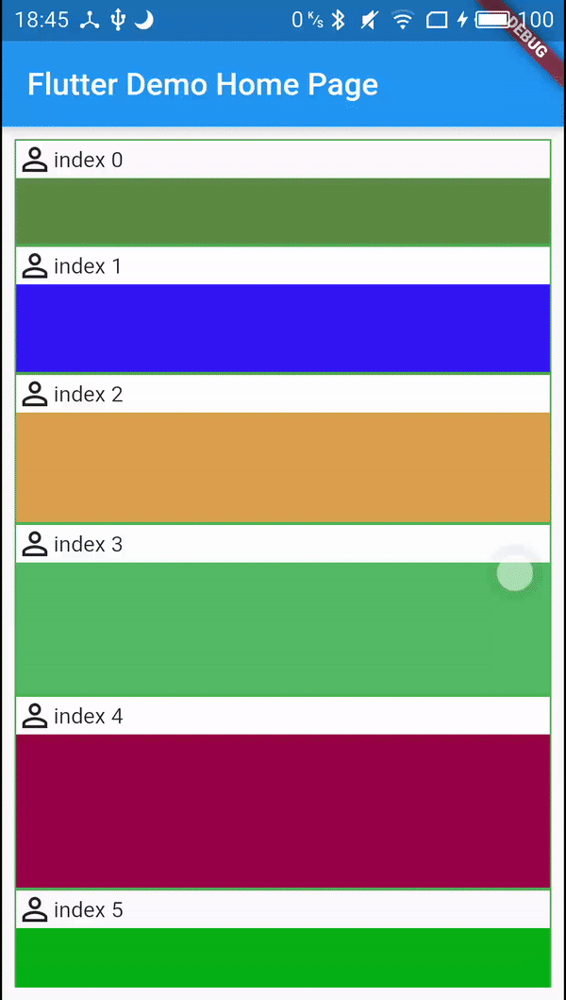

### 简介

[english documentation is here,translate by google translate](./README_EN.md)

Flutter列表Item侧滑菜单组件， flutter_slidable_list_view [github](https://github.com/tsx1453/flutter_slidable_list_view),[pub](https://pub.dev/packages/flutter_slidable_list_view)的优化重构版
部分实现借鉴了[Provider](https://pub.dev/packages/provider)

每个Item的菜单Action数量、Widget可以自由定制，相比于之前的flutter_slidable_list_view，不再与ListView绑定，同时优化了性能，之前滑动一个整个列表所有元素重建，现在仅会重建极小的一部分，目前刷新范围已经控制到最小，后续如有优化空间会继续优化

### 使用

在原有ListView的基础上，外层使用`SlideConfiguration`包裹侧滑菜单的相关配置信息，然后将
原有item使用`SlideItem`进行包裹即可，使用方法请参考示例程序的代码，涉及到的类的参数含义将在下面解释

#### 注
因为用到了InheritedWidget，本package开发环境使用的是flutter -v1.12版本，已使用最新的`dependOnInheritedWidgetOfExactType`等方法获取
InheritedWidget，若老版本需要使用可使用带有后缀-adapt的版本

### 参数含义

##### SlideConfiguration

| 参数|  含义 | 类型 |
|:-:| :-: |:-:|
|  child |子Widget | Widget |
| config | SlideConfig类型的配置Bean | SlideConfig |
|controller|控制列表元素滑动状态|SlideController|

##### SlideConfig

|          参数           |                             含义                             |   类型   |    默认值    |
| :---------------------: | :----------------------------------------------------------: | :------: | :----------: |
|    supportElasticity    | 是否支持弹性滑动（即滑动打开菜单时是否可以超过设定值然后反弹） |   Bool   |     True     |
| closeOpenedItemOnTouch  |  已经打开的Item在触摸其左侧的内容区域的时候是否直接关闭菜单  |   Bool   |     fal      |
|     slideProportion     |   每个菜单Item的宽度所占的比例（相对于整个ListItem的宽度）   |  double  |     0.25     |
|  elasticityProportion   |                    弹性滑动的额外可越界值                    | double |     0.1      |
|   actionOpenCloseThreshold   |                打开/关闭 菜单所需要的最低的侧滑比例                |  double  |     0.5      |
|     backgroundColor     | Item的背景颜色（因为使用Stack实现的菜单Item，所以如果列表元素透明会导致重叠），不可为Colors.transparent |  Color   | Colors.white |
|  slideOpenAnimDuration  | 打开侧边菜单的动画持续时间，这里的时间时从0到完全打开的总时间，实际手指抬起后的动画时间会根据已运动比例来获取实际所需时间 | Duration |    200ms     |
| slideCloseAnimDuration  |            关闭侧边菜单动画的持续时间（规则同上）            | Duration |    200ms     |
| deleteStep1AnimDuration | 删除动画第一阶段（删除按钮Widget大小扩展为整个列表Item大小）持续时间 | Duration |    200ms     |
| deleteStep2AnimDuration |          删除动画第二阶段（Item的高度变化）持续时间          | Duration |    200ms     |
|slideWidth|每个菜单Item的宽度（此参数不为空时会以此参数为准）|double|null|

##### SlideItem

|    参数     |          含义          |       类型       | 默认值 |
| :---------: | :--------------------: | :--------------: | :----: |
| indexInList | 当前Item在列表中的位置 |       int        |  null  |
|   actions   |   菜单Item的元素列表   | List<SlideAction> |  []  |
|    child    |         child          |      Widget      |  null  |
|  slidable   |      是否可以滑动      |       bool       |  true  |
| leftActions| 从左向右滑动的菜单Item | List<SlideAction> | [] |

##### SlideAction

|      参数      |                             含义                             |       类型        | 默认值 |
| :------------: | :----------------------------------------------------------: | :---------------: | :----: |
| isDeleteButton |          是否是删除按钮，用于标记删除Widget执行动画          |       bool        | false  |
|  actionWidget  |                    侧边菜单的Item的Widget                    |      Widget       |  null  |
|  tapCallback   | Action被点击时的回调，会提供Slide对象可用于执行关闭、删除等操作的动画 | ActionTapCallaack |  Null  |

##### Slide

| 方法/成员   | 含义                 | 参数                          | 返回值                       |
| ----------- | -------------------- | ----------------------------- | ---------------------------- |
| close       | 关闭侧滑菜单         | 🈚️                             | void                         |
| delete      | 执行删除动画         | 可选参数,useAnim,默认值true， | Future，返回动画执行的future |
| indexInList | item在列表中的位置 | 无                            | int                          |

